# 图书馆管理系统功能模块说明

本系统采用前后端分离架构，支持 **管理员/馆员端** 与 **读者端** 两类用户，围绕图书资源管理与借阅业务，提供完整的信息化管理功能。

---
## 技术亮点
- 前后端分离架构：前端采用vue3+tailwindcss，后端采用fastapi，实现前后端分离开发模式，提升开发效率与用户体验。
- 基于 JWT 的身份认证：采用 JSON Web Token（JWT）实现用户身份验证与授权，有效防止恶意用户伪造请求。
- 图书信息全面：系统支持图书分类、出版社、作者、ISBN等信息的管理，并提供图书检索、信息展示等功能。
- 借阅管理功能：系统支持读者自主借阅图书，管理员/馆员可代办借阅业务，并提供图书归还、罚款管理等功能。
- 系统搜索与智能辅助：系统支持 Algolia 智能全文检索服务，为读者提供更高效的书目检索体验。

## 一、登录与权限管理模块

**功能说明：**
- 支持管理员、馆员、读者三种角色登录
- 采用账号 + 密码登录方式，基于 JWT 实现身份认证
- 根据用户角色动态控制页面展示与接口访问权限

**作用：**
- 确保系统安全性
- 实现不同用户“能看什么、能做什么”的权限隔离
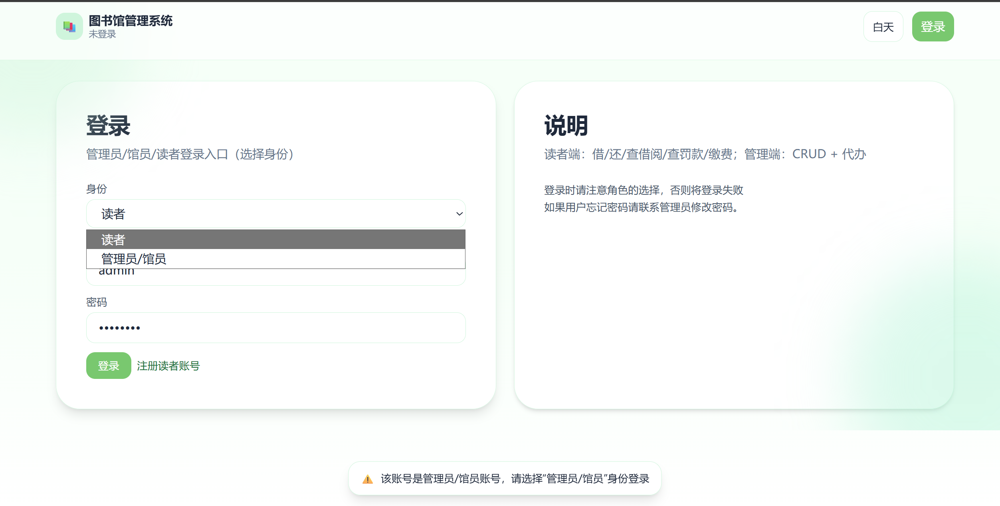 
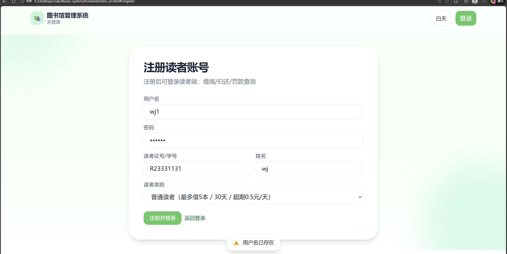 
---

## 二、系统首页（主界面）

**功能说明：**
- 展示系统欢迎信息与当前登录用户身份
- 提供常用功能快捷入口（查书、借阅记录、罚款等）
- 管理员与读者登录后显示不同内容

**作用：**
- 作为系统入口与导航中心
- 提高用户操作效率与系统可用性
 
 
---

## 三、图书查询与搜索模块

**功能说明：**
- 展示图书基本信息（书名、ISBN、出版社、可借数量等）
- 支持本地过滤与 Algolia 智能全文搜索
- 搜索支持实时联想与无结果提示

**作用：**
- 帮助读者快速查找所需图书
- 为借阅业务提供前置支持
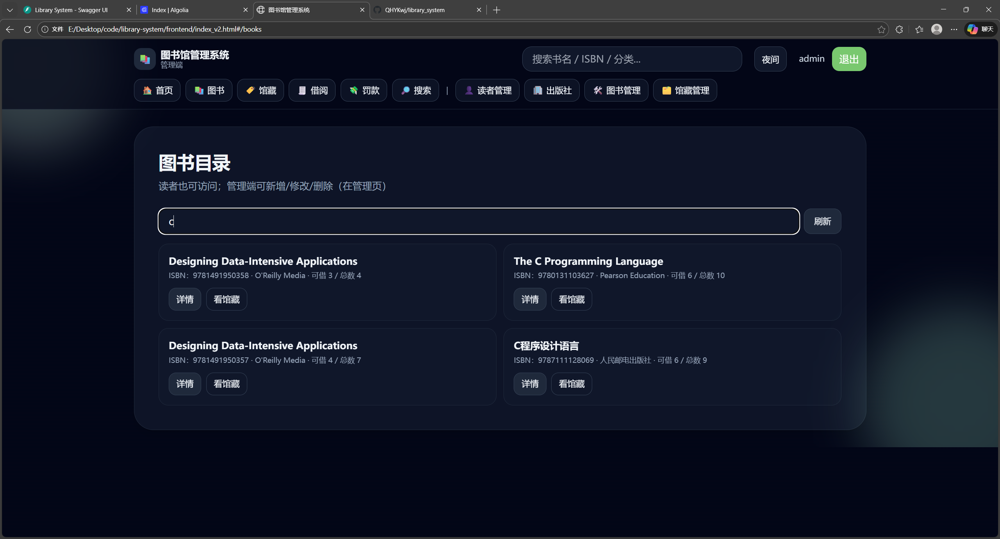 
---

## 四、图书详情与馆藏管理模块

**功能说明：**
- 查看单本图书的详细信息与馆藏情况
- 管理员可维护图书基本信息
- 查看每册图书的状态（可借、已借、维修等）

**作用：**
- 实现“书 → 册”的精细化管理
- 支撑借阅、归还等核心业务
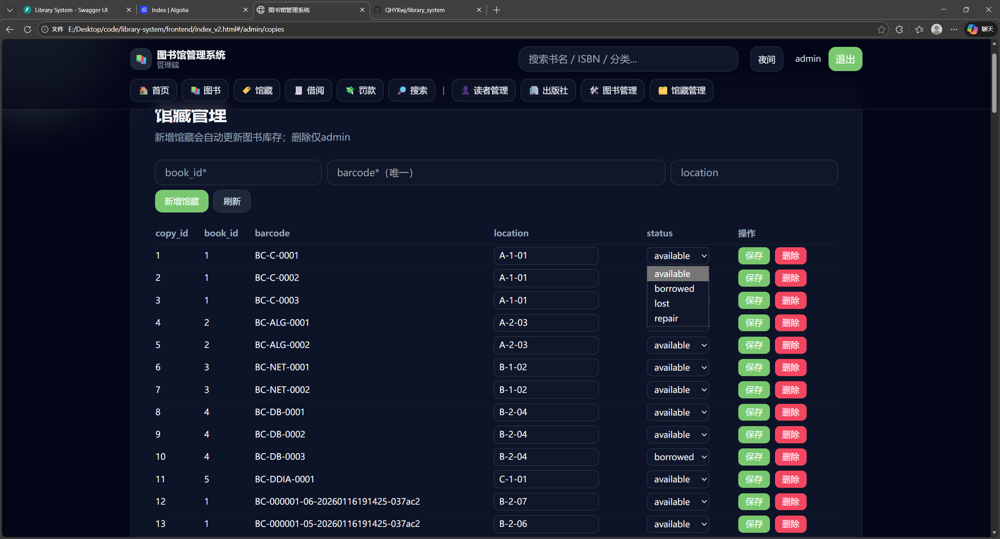 
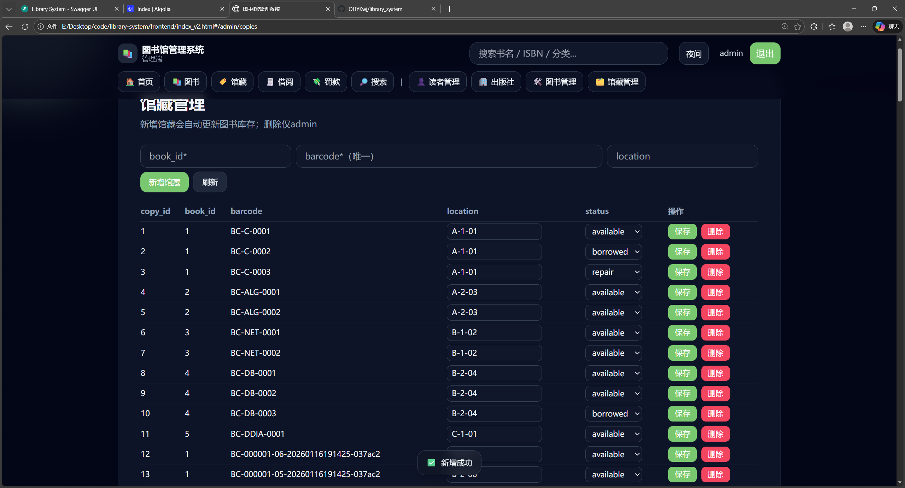 
---

## 五、读者信息管理模块（管理端）

**功能说明：**
- 管理读者基本信息与读者类别
- 设置借阅上限、借阅天数、罚款规则
- 查看读者借阅数量与罚款情况

**作用：**
- 规范读者管理
- 为借阅与罚款规则提供数据基础
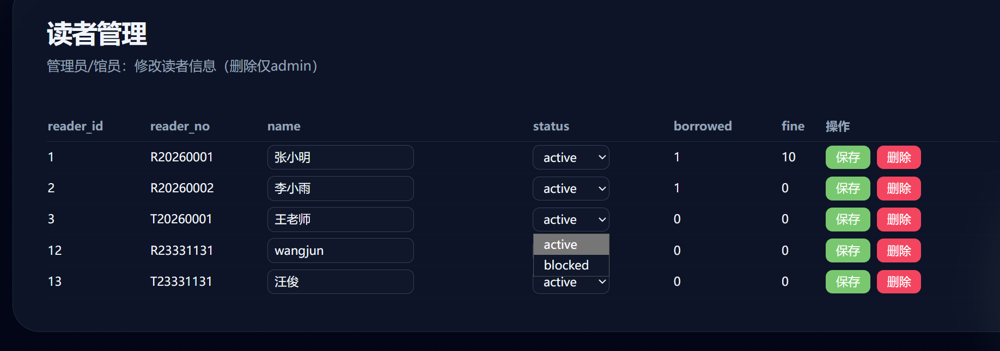 

---

## 六、出版社与图书信息管理模块（管理端）

**功能说明：**
- 管理出版社信息
- 维护图书基本信息（书名、ISBN、分类、价格等）
- 支持新增、修改、删除操作

**作用：**
- 保障图书数据的完整性与规范性
- 为检索与馆藏管理提供基础数据
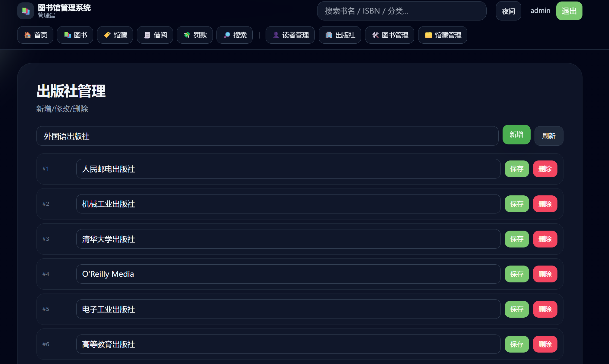 
 
---

## 七、图书借阅管理模块

**功能说明：**
- 读者可自行借阅图书
- 管理员/馆员可代办借阅业务
- 自动生成借阅记录并更新库存数量

**作用：**
- 实现图书流转的核心业务逻辑
- 保证借阅过程的可追溯性
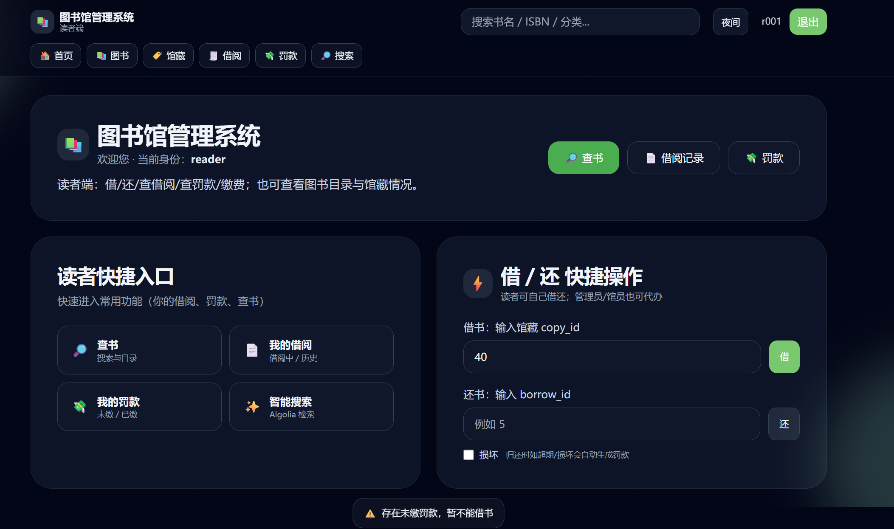 
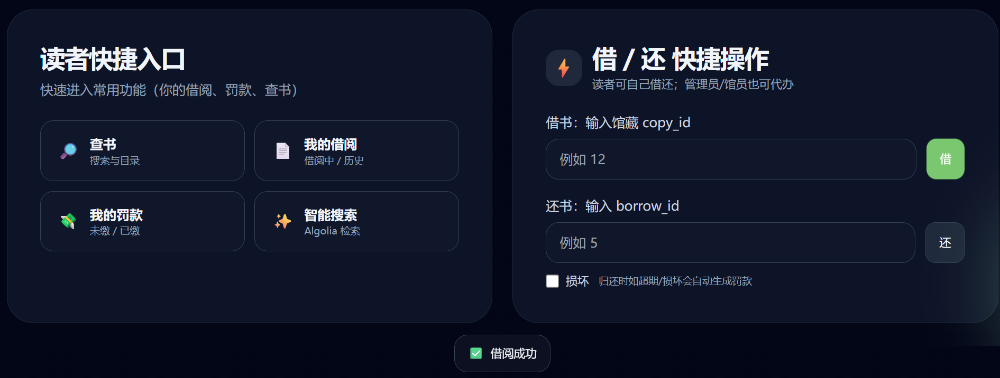 
---

## 八、图书归还管理模块

**功能说明：**
- 支持正常归还、超期归还、损坏归还等情况
- 自动计算超期天数与罚款金额
- 更新馆藏状态与读者借阅数量

**作用：**
- 保证馆藏状态的准确性
- 为罚款管理提供数据来源
 

---

## 九、罚款与缴费管理模块

**功能说明：**
- 自动生成超期、损坏等罚款记录
- 读者可在线完成罚款缴费
- 记录罚款历史与缴费方式

**作用：**
- 规范图书使用行为
- 实现罚款流程的信息化管理
 
---

## 十、系统搜索与智能辅助模块（可选）

**功能说明：**
- 基于 Algolia 的全文检索服务
- 支持模糊搜索、关键词联想
- 提供更高效的书目检索体验

**作用：**
- 提升系统检索性能与用户体验
- 满足大数据量场景下的快速查询需求
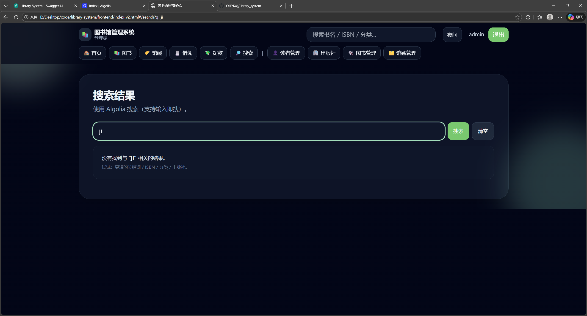 
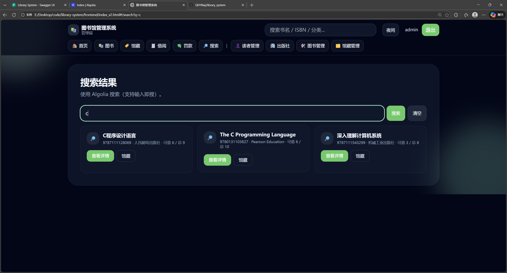
---

## 总结

本图书馆管理系统以 **图书资源管理** 与 **借阅业务流程** 为核心，结合角色权限控制与现代化前端界面设计，实现了一个功能完整、结构清晰、体验友好的信息化管理平台。
